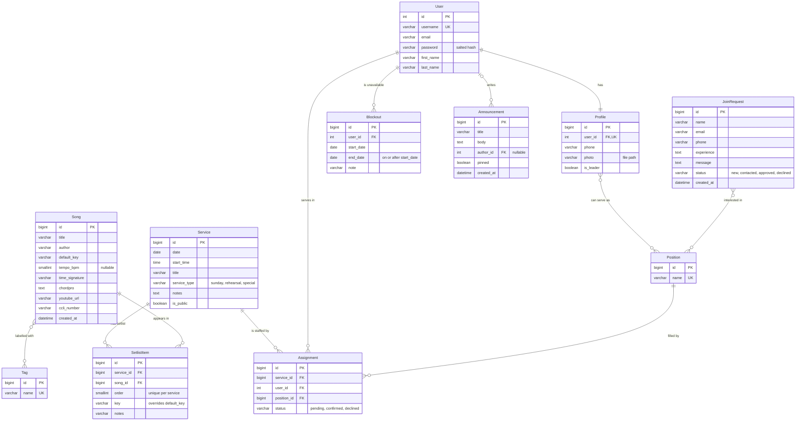

# Tehillim: database design

## 1. Overview

Tehillim is a reusable website template for a church worship and music team. The database
supports the private team portal and the public Join form. It stores **who is on the team**
(Django users, their profiles, and the positions they can serve in), **what the team plays**
(a song library with keys, tempo, ChordPro charts, and tags), **when and how they serve**
(services with ordered setlists, a roster of assignments, and blockout dates when members are
unavailable), and **team communication** (announcements and join requests from visitors). The
goal is to replace group-chat messages and spreadsheets with one consistent source of truth, so
the design favours foreign keys and constraints that keep the data correct even if a bug or a
manual edit tries to break it.

The schema is implemented as four Django apps (`accounts`, `music`, `scheduling`, `community`)
in `backend/`, and also as a standalone MySQL 8 script, `backend/schema.sql`.

## 2. Entity-relationship diagram

Many-to-many relationships are stored in join tables that Django creates automatically:
`accounts_profile_positions`, `music_song_tags`, and `community_joinrequest_positions_interested`.
Each has a unique pair of foreign keys so the same link can't be stored twice.

## 3. Tables

Types are the MySQL types Django generates. Text fields marked "default ''" are optional in
forms but stored as an empty string rather than NULL (Django's convention, so there is only one
way to mean "empty"). All tables use InnoDB and utf8mb4.

### User (`auth_user`, Django built-in)

| Field       | Type          | Keys / constraints     | Description                              |
|-------------|---------------|------------------------|------------------------------------------|
| id          | INT           | PK, auto-increment     | Identifier                               |
| username    | VARCHAR(150)  | UNIQUE, NOT NULL       | Login name                               |
| email       | VARCHAR(254)  | NOT NULL               | Contact email                            |
| password    | VARCHAR(128)  | NOT NULL               | Salted password hash (never plain text)  |
| first_name  | VARCHAR(150)  | NOT NULL               | First name                               |
| last_name   | VARCHAR(150)  | NOT NULL               | Last name                                |
| is_staff, is_superuser, is_active, last_login, date_joined | BOOLEAN / DATETIME | | Django account flags and timestamps |

### Profile (`accounts_profile`)

| Field     | Type          | Keys / constraints                              | Description                          |
|-----------|---------------|-------------------------------------------------|--------------------------------------|
| id        | BIGINT        | PK                                              | Identifier                           |
| user_id   | INT           | FK → User, UNIQUE, NOT NULL, ON DELETE CASCADE  | The account this profile extends (1-1) |
| phone     | VARCHAR(30)   | NOT NULL, default ''                            | Phone number, stored as text         |
| photo     | VARCHAR(100)  | NOT NULL, default ''                            | Path of the uploaded photo in media/ |
| is_leader | BOOLEAN       | NOT NULL, default FALSE                         | Can plan services and manage the team |
| positions | M-N → Position| join table `accounts_profile_positions`         | Positions this member can serve in   |

### Position (`accounts_position`)

| Field | Type        | Keys / constraints | Description                         |
|-------|-------------|--------------------|-------------------------------------|
| id    | BIGINT      | PK                 | Identifier                          |
| name  | VARCHAR(50) | UNIQUE, NOT NULL   | e.g. Worship leader, Vocals, Keys   |

### Song (`music_song`)

| Field          | Type              | Keys / constraints        | Description                              |
|----------------|-------------------|---------------------------|------------------------------------------|
| id             | BIGINT            | PK                        | Identifier                               |
| title          | VARCHAR(200)      | NOT NULL                  | Song title                               |
| author         | VARCHAR(200)      | NOT NULL, default ''      | Writer or composer                       |
| default_key    | VARCHAR(10)       | NOT NULL                  | Usual key, e.g. G or F#m                 |
| tempo_bpm      | SMALLINT UNSIGNED | NULL allowed              | Beats per minute; NULL = unknown         |
| time_signature | VARCHAR(10)       | NOT NULL, default '4/4'   | e.g. 3/4, 6/8                            |
| chordpro       | TEXT              | NOT NULL, default ''      | Lyrics and chords in ChordPro format     |
| youtube_url    | VARCHAR(200)      | NOT NULL, default ''      | Reference recording                      |
| ccli_number    | VARCHAR(20)       | NOT NULL, default ''      | CCLI song number for licensing reports   |
| created_at     | DATETIME(6)       | NOT NULL, set on insert   | When the song was added                  |
| tags           | M-N → Tag         | join table `music_song_tags` | Labels used for filtering             |

### Tag (`music_tag`)

| Field | Type        | Keys / constraints | Description                        |
|-------|-------------|--------------------|------------------------------------|
| id    | BIGINT      | PK                 | Identifier                         |
| name  | VARCHAR(50) | UNIQUE, NOT NULL   | e.g. hymn, opening, communion      |

### Service (`scheduling_service`)

| Field        | Type         | Keys / constraints                                           | Description                         |
|--------------|--------------|--------------------------------------------------------------|-------------------------------------|
| id           | BIGINT       | PK                                                           | Identifier                          |
| date         | DATE         | NOT NULL                                                     | Day of the service                  |
| start_time   | TIME         | NOT NULL                                                     | Start time                          |
| title        | VARCHAR(200) | NOT NULL                                                     | e.g. Sunday Morning Worship         |
| service_type | VARCHAR(20)  | NOT NULL, choices: sunday / rehearsal / special, default sunday | Kind of event                    |
| notes        | TEXT         | NOT NULL, default ''                                         | Planning notes                      |
| is_public    | BOOLEAN      | NOT NULL, default FALSE                                      | Shown on the public Events page     |

### SetlistItem (`scheduling_setlistitem`)

| Field      | Type              | Keys / constraints                            | Description                               |
|------------|-------------------|-----------------------------------------------|-------------------------------------------|
| id         | BIGINT            | PK                                            | Identifier                                |
| service_id | BIGINT            | FK → Service, NOT NULL, ON DELETE CASCADE     | The service this song is played at        |
| song_id    | BIGINT            | FK → Song, NOT NULL, ON DELETE PROTECT (RESTRICT) | The song                              |
| order      | SMALLINT UNSIGNED | NOT NULL, UNIQUE (service_id, order)          | Position in the setlist (1, 2, 3...)      |
| key        | VARCHAR(10)       | NOT NULL, default ''                          | Key for this service; '' = song's default |
| notes      | VARCHAR(255)      | NOT NULL, default ''                          | e.g. "a cappella last verse"              |

### Assignment (`scheduling_assignment`)

| Field       | Type        | Keys / constraints                                  | Description                     |
|-------------|-------------|-----------------------------------------------------|---------------------------------|
| id          | BIGINT      | PK                                                  | Identifier                      |
| service_id  | BIGINT      | FK → Service, NOT NULL, ON DELETE CASCADE           | Which service                   |
| user_id     | INT         | FK → User, NOT NULL, ON DELETE CASCADE              | Who is serving                  |
| position_id | BIGINT      | FK → Position, NOT NULL, ON DELETE PROTECT (RESTRICT) | In which role                 |
| status      | VARCHAR(10) | NOT NULL, choices: pending / confirmed / declined, default pending | Member's response |
|             |             | UNIQUE (service_id, user_id, position_id)           | No duplicate roster rows        |

### Blockout (`scheduling_blockout`)

| Field      | Type         | Keys / constraints                       | Description                    |
|------------|--------------|------------------------------------------|--------------------------------|
| id         | BIGINT       | PK                                       | Identifier                     |
| user_id    | INT          | FK → User, NOT NULL, ON DELETE CASCADE   | The unavailable member         |
| start_date | DATE         | NOT NULL                                 | First unavailable day          |
| end_date   | DATE         | NOT NULL, CHECK (end_date >= start_date) | Last unavailable day           |
| note       | VARCHAR(200) | NOT NULL, default ''                     | Optional reason                |

### Announcement (`community_announcement`)

| Field      | Type         | Keys / constraints                       | Description                       |
|------------|--------------|------------------------------------------|-----------------------------------|
| id         | BIGINT       | PK                                       | Identifier                        |
| title      | VARCHAR(200) | NOT NULL                                 | Headline                          |
| body       | TEXT         | NOT NULL                                 | Message text                      |
| author_id  | INT          | FK → User, NULL allowed, ON DELETE SET NULL | Leader who posted it           |
| pinned     | BOOLEAN      | NOT NULL, default FALSE                  | Keep at the top of the list       |
| created_at | DATETIME(6)  | NOT NULL, set on insert                  | When it was posted                |

### JoinRequest (`community_joinrequest`)

| Field                | Type           | Keys / constraints                                   | Description                         |
|----------------------|----------------|------------------------------------------------------|-------------------------------------|
| id                   | BIGINT         | PK                                                   | Identifier                          |
| name                 | VARCHAR(100)   | NOT NULL                                             | Applicant's name                    |
| email                | VARCHAR(254)   | NOT NULL                                             | Applicant's email                   |
| phone                | VARCHAR(30)    | NOT NULL, default ''                                 | Optional phone                      |
| positions_interested | M-N → Position | join table `community_joinrequest_positions_interested` | Roles they'd like to serve in    |
| experience           | TEXT           | NOT NULL, default ''                                 | Musical or technical experience     |
| message              | TEXT           | NOT NULL, default ''                                 | Anything else they want to say      |
| status               | VARCHAR(10)    | NOT NULL, choices: new / contacted / approved / declined, default new | Where the leader is in follow-up |
| created_at           | DATETIME(6)    | NOT NULL, set on insert                              | When the form was submitted         |

## 4. Normalization decisions

- **User + Profile instead of a custom user table.** Django's built-in User already handles
  passwords and login securely; team-specific data lives in Profile (one-to-one). This keeps
  each fact in one place without rewriting authentication.
- **Positions are a table, not text.** Profile, Assignment and JoinRequest all reference
  `Position` by foreign key, so "Keys" is spelled once, can be renamed in one place, and a
  church can add its own roles without code changes.
- **Song tags as a `Tag` table with an M-N link** (instead of a comma-separated text field).
  A text field would break first normal form (several values in one column), make "all
  communion songs" a slow and error-prone `LIKE '%communion%'` search, and allow duplicates
  through typos. With a join table, filtering is an exact, indexed join.
- **`JoinRequest.positions_interested` as M-N to Position**, for the same reasons: the leader
  can filter applicants by role, and the options match the positions used on the roster.
- **SetlistItem as an association table with its own data.** A setlist is a many-to-many
  between Service and Song, but each link also needs an order, a key and notes, so it is a
  full model. `UNIQUE (service, order)` prevents two songs from both being "song #2".
  Its `key` overrides the song's `default_key` for that day without changing the library.
- **`UNIQUE (service, user, position)` on Assignment** stops the same person being added twice
  to the same role in the same service. Different positions for the same person are allowed on
  purpose (a leader who also plays keys) and surfaced as a warning instead.
- **`CHECK (end_date >= start_date)` on Blockout**, declared as a Django `CheckConstraint`, so
  the database itself rejects impossible date ranges (MySQL 8.0.16+ enforces CHECK).
- **Deletion rules chosen per relationship.** CASCADE where the child has no meaning on its own
  (a profile, setlist items, assignments, blockouts); PROTECT/RESTRICT where deleting would
  silently erase history (a song used in setlists, a position used on the roster); SET NULL for
  announcement authors so team messages survive an account being removed.
- **Choices stored as short strings** (`VARCHAR` + Django `TextChoices`) rather than MySQL
  `ENUM`: readable in raw SQL, portable to SQLite, and adding a value is a simple migration.
  `schema.sql` adds matching `CHECK (... IN (...))` constraints.

## 5. Business rules

- **Roster conflict warning.** `Assignment.conflicts()` returns human-readable warnings when
  (1) the member has a Blockout whose range covers the service date
  (`start_date <= service.date <= end_date`), or (2) the member is already assigned to the same
  service in another position. These are warnings, not errors: the leader decides. The admin
  shows them in the Assignments list and on each service's roster.
- **Assignment status:** `pending` (default, waiting for the member), `confirmed`, `declined`.
  Members will be able to change only their own assignment's status through the API.
- **JoinRequest status:** `new` (default), `contacted`, `approved`, `declined`.
- **Service type:** `sunday` (default), `rehearsal`, `special`. Only services with
  `is_public = TRUE` will appear on the public Events page.
- **Leaders** are users whose Profile has `is_leader = TRUE`; they manage songs, services,
  the roster and join requests.
- **Demo data** uses fictional `@example.com` users and public-domain hymns only, with at most
  the first line of lyrics. Teams add their own songs under their CCLI license.

## 6. How to run it

Setup steps (virtual environment, `.env`, `migrate`, `createsuperuser`, the admin, switching
to MySQL, and loading `schema.sql` directly with `mysql -u root -p < schema.sql`) are in
[`backend/README.md`](../backend/README.md).
