# Tehillim: design document

Tehillim (Hebrew תְּהִלִּים, "praises," the book of Psalms) is a reusable website template for a
church worship and music team. Any team can copy it and change one settings file to make it
their own. This document covers the visual design and the front-end structure of Phase 1,
the public site. The database design is in [database-design.md](database-design.md).

**Status:** Phase 1 (public site) is complete: five pages in plain HTML, CSS, and JavaScript,
in the `site/` folder. To view it, open `site/index.html` in a browser (or use VS Code Live Server).

## 1. Project scope and phases

| Phase | What it delivers | Technology | Status |
|---|---|---|---|
| 1 | Public site: Home, Meet the team, Songs, Events, Join | HTML, CSS, vanilla JavaScript | Done |
| 2 | Song library and setlists (team portal, mock data) | React, Vite, React Router | Planned |
| 3 | Login, schedule, admin, real database | Django, Django REST Framework, MySQL | Database designed and modeled |
| 4 | Chord transposer, lyrics display, reminders, practice tracks | React and Django | Planned |

Users: **visitors** (public pages, join form), **team members** (portal), and **worship leaders**
(manage songs, setlists, roster, members).

## 2. Design principles

The brand in one line: *reverent, warm, and prepared, like a good rehearsal.*

1. **One bold moment, then calm.** The large Hebrew word appears once, in the home hero.
   Every other page stays quiet.
2. **Lines, not shadows.** Cards and sections are defined by 1px hairline borders. No drop
   shadows, no gradients.
3. **One main action per page.** Only the single most important button on a page uses the
   pomegranate (red) color, e.g. "Join the team" or "Send application".
4. **Mobile first.** Designed at 360px wide, then 768px and 1280px. Most team members use
   their phones at rehearsal.
5. **Accessible by default.** WCAG AA contrast, visible keyboard focus, labels on every input,
   44px touch targets, and color never used as the only signal.
6. **Plain, warm copy.** Sentence case everywhere. Buttons say exactly what happens. Error
   messages explain the fix ("Enter an email so we can reply", not "Invalid input").

## 3. Visual system

All values are CSS custom properties ("design tokens") defined once at the top of
`site/css/styles.css`. No color is hard-coded anywhere else, so the whole site can switch
to the dark theme by changing variables only.

### Color

| Token | Day value | Role |
|---|---|---|
| `--surface` | #F5F6F2 | Page background (cool linen) |
| `--surface-raised` | #FFFFFF | Cards and inputs |
| `--ink` | #0F1E33 | Main text |
| `--ink-muted` | #4B5A6E | Secondary text, captions |
| `--tekhelet` | #1E4D7B | Brand blue: links, secondary buttons, active nav |
| `--pomegranate` | #9B2D3F | The one primary action per page |
| `--brass` | #85652F | Thin details only (Selah divider, logo rule) |
| `--olive` | #3D6B2C | Success / confirmed |
| `--danger` | #B3261E | Errors / declined |
| `--line` | #D6DBD2 | Hairline borders |

A second theme, **Night watch** (dark), redefines the same tokens under `[data-theme="dark"]`.

### Typography

| Use | Font | Notes |
|---|---|---|
| Headings, scripture, Hebrew | Frank Ruhl Libre (serif) | Weight 500, never bolder |
| Body, buttons, forms | Assistant (sans-serif) | 16px base, line height 1.6 |

Both fonts come from Google Fonts and fully support Hebrew. Paragraphs are capped at 68
characters wide for comfortable reading.

### Spacing and layout

- 4px spacing grid (`--space-1` = 4px up to `--space-24` = 96px).
- Page gutters: 24px on phones, 48px on desktop. Content is capped at 1120px.
- Breakpoints: 768px (tablet: nav moves into the header, grids go multi-column) and
  1024px (wider gutters).
- Corner radius: 4px (inputs), 8px (cards, buttons), 16px (photos).

## 4. Components

| Component | Where it's used | Notes |
|---|---|---|
| Header and wordmark | Every page | "Tehillim │ תְּהִלִּים" set in live text, so it follows the theme |
| Navigation | Every page | Collapses behind a "Menu" button below 768px. Current page underlined. |
| Footer | Every page | Church name, service times, email, social links, year |
| Buttons | All pages | Primary (pomegranate), secondary (blue outline) |
| Selah divider | Home, Songs | "Selah" between two brass hairlines, a musical pause between sections |
| Hero | Home | Large Hebrew word, meaning, title, Psalm 150:6 |
| Song card | Songs | Title and author |
| Member card | Meet the team | Square photo, name, positions |
| Event card | Events | Date and time, title, description, blue left edge |
| Form field | Join | Label, input, inline error message, hint text |

## 5. Pages

### Home (`index.html`)
Hero with the Hebrew wordmark and Psalm 150:6, a "Next service" card (service and rehearsal
times), About, a songs preview, and the "Join the team" call to action.

| Phone (360px) | Desktop (1280px) |
|---|---|
| 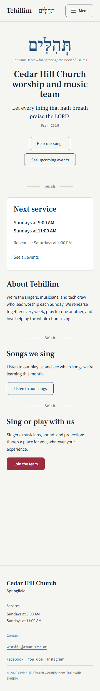 | 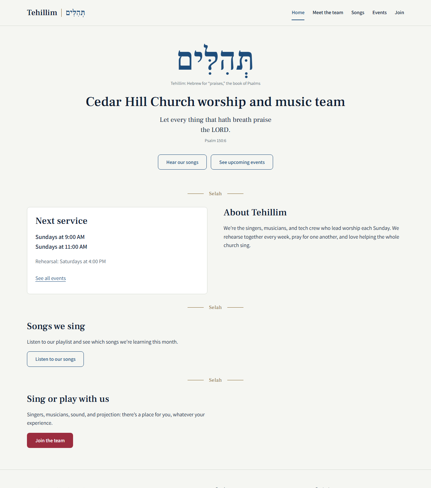 |

### Meet the team (`team.html`)
Member cards grouped into Vocals, Band, and Tech. Cards are generated by JavaScript from an
array in `team.js`. Placeholder names and photos until a team adds its own.

| Phone (360px) | Desktop (1280px) |
|---|---|
| 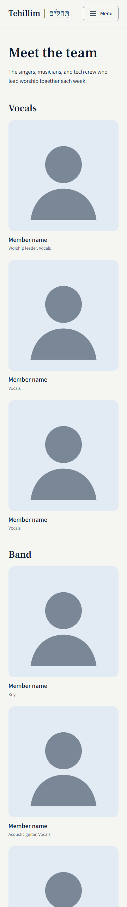 | 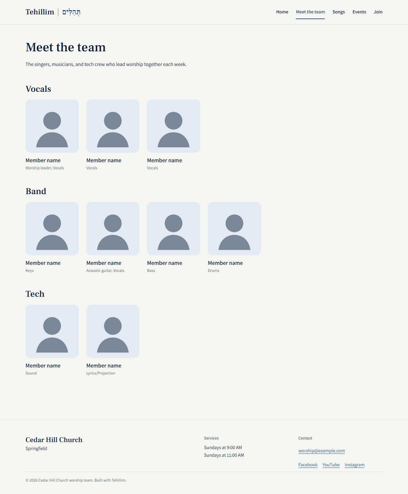 |

### Songs (`songs.html`)
Embedded Spotify playlist (or a "coming soon" note when no link is set), and a "Songs we're
learning this month" card grid. Demo songs are public-domain hymns.

| Phone (360px) | Desktop (1280px) |
|---|---|
| 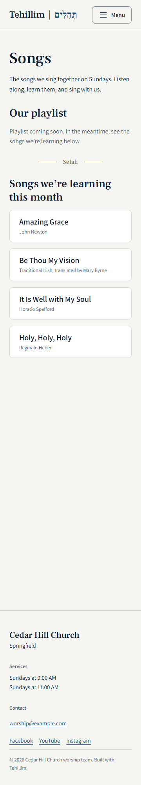 | 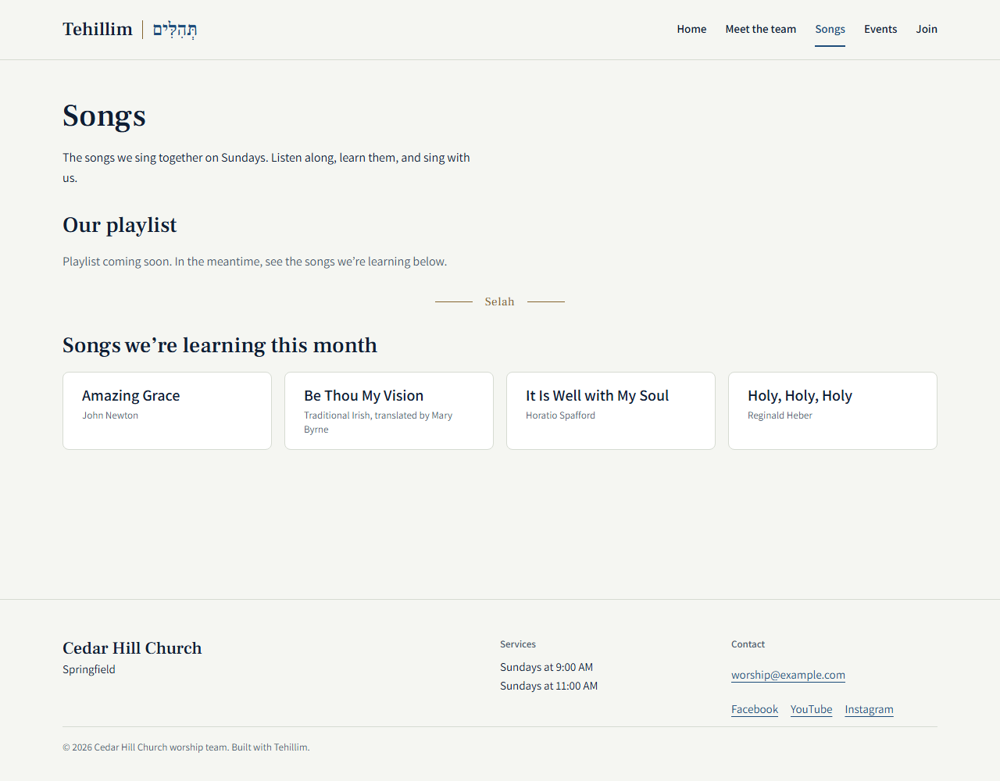 |

### Events (`events.html`)
Upcoming events from an array in `events.js`, sorted by date. Past events are hidden
automatically by comparing each event's date with today's date.

| Phone (360px) | Desktop (1280px) |
|---|---|
| 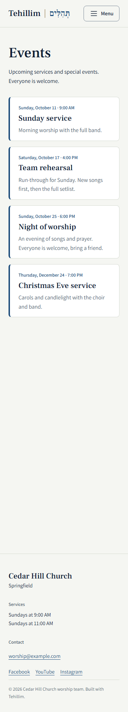 | 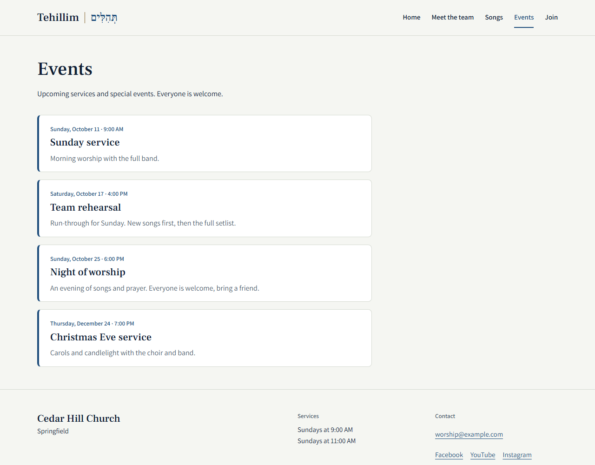 |

### Join the team (`join.html`)
Psalm 33:3, a welcome, and the application form: full name and email (required), phone
(optional), positions (at least one), experience level, and message (max 500 characters,
with a live counter). Validation shows inline errors, clears them as the user fixes each
field, and moves focus to the first problem. A valid submission shows a thank-you message.
In Phase 3 it posts to the database (`POST /api/join-requests/`).

| Phone (360px) | Desktop (1280px) |
|---|---|
| 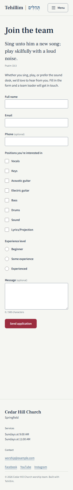 | 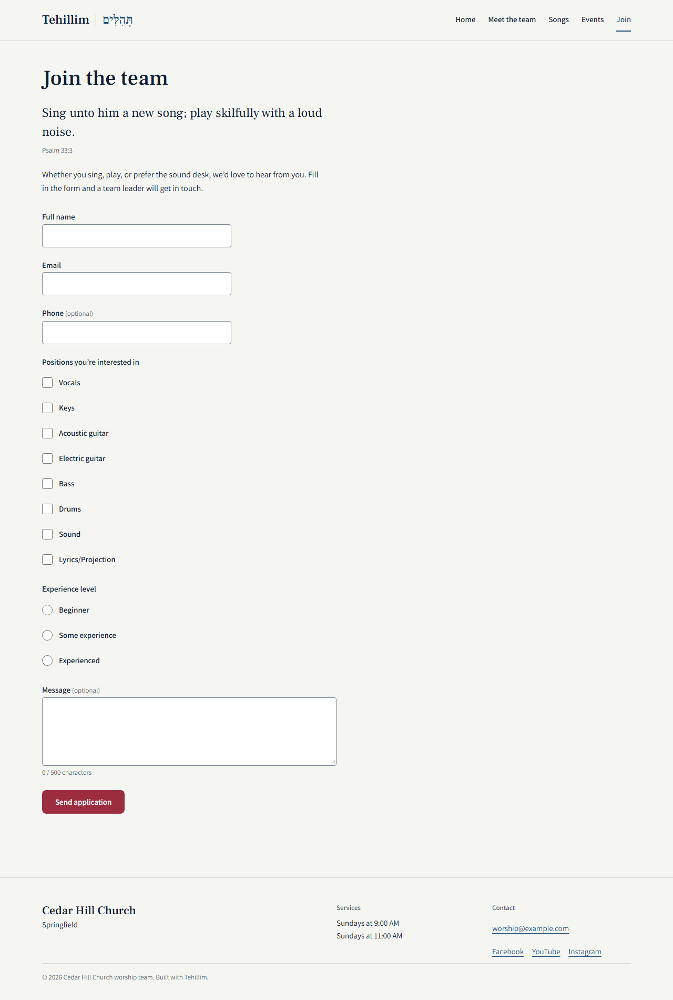 |

### Mobile navigation
Closed and open states. The menu button uses `aria-expanded`, works with mouse, touch, and
keyboard, and closes with Escape.

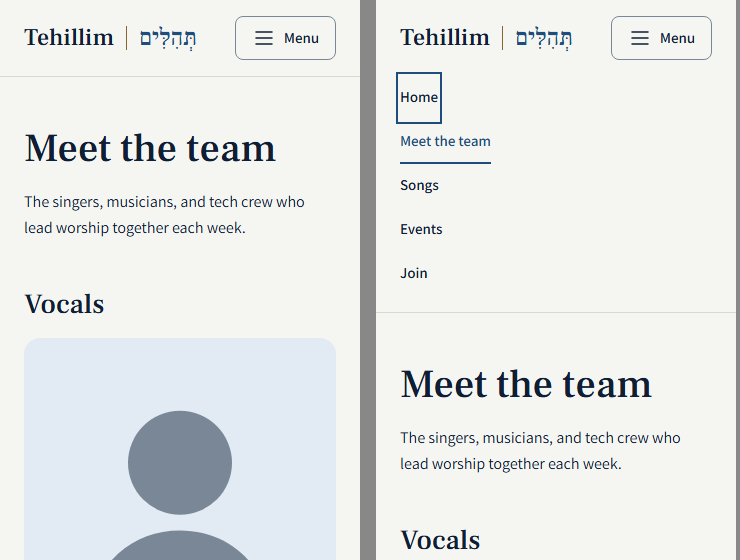

## 6. Front-end structure

```
site/
├── index.html, team.html, songs.html, events.html, join.html
├── css/styles.css      design tokens + all styles, mobile first
├── js/
│   ├── config.js       team settings: the one file a new team edits
│   ├── main.js         shared: fill in settings, mobile menu, current page, footer year
│   ├── songs.js        playlist embed + song cards
│   ├── team.js         member cards from an array
│   ├── events.js       upcoming events, past ones hidden
│   └── join.js         form validation
└── assets/images/      favicon, placeholder member photo
```

**Key design decision: data separate from layout.** Team-specific details (church name,
service times, email, social links, songs) live in `config.js`. The HTML marks empty spots
with attributes like `data-config="churchName"`, and `main.js` fills them in. A new team
edits one file and never touches the HTML. The same idea carries into Phase 2 (React
components with JSON data) and Phase 3 (data from the database API).

## 7. Accessibility checklist

| Requirement | How it's met |
|---|---|
| Semantic HTML | `header`, `nav`, `main`, `section`, `footer`, `fieldset`/`legend`, `blockquote`/`cite`, `time` |
| Keyboard | Skip-to-content link, visible focus ring on everything, Escape closes the menu |
| Screen readers | `aria-expanded`, `aria-current="page"`, `aria-invalid`, errors linked with `aria-describedby`, `lang="he" dir="rtl"` on Hebrew |
| Contrast | Brand token pairs meet WCAG AA (4.5:1 text, 3:1 borders and focus) |
| Touch | Every link, button, and checkbox label is at least 44px tall |
| Not color alone | Current page has an underline. Errors have text, not just a red border. |
| Images | Alt text on every image. Decorative elements are `aria-hidden`. |
| No-JS fallback | The nav stays visible if JavaScript is off |
